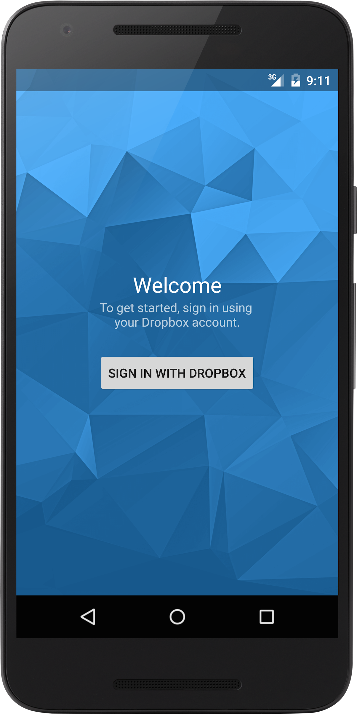
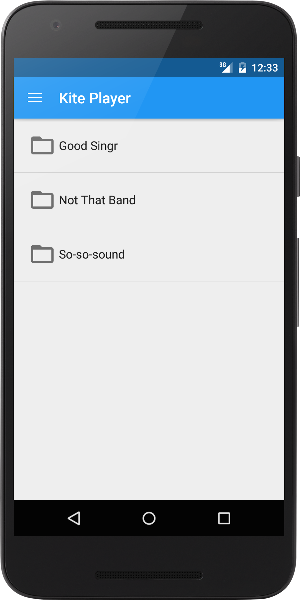
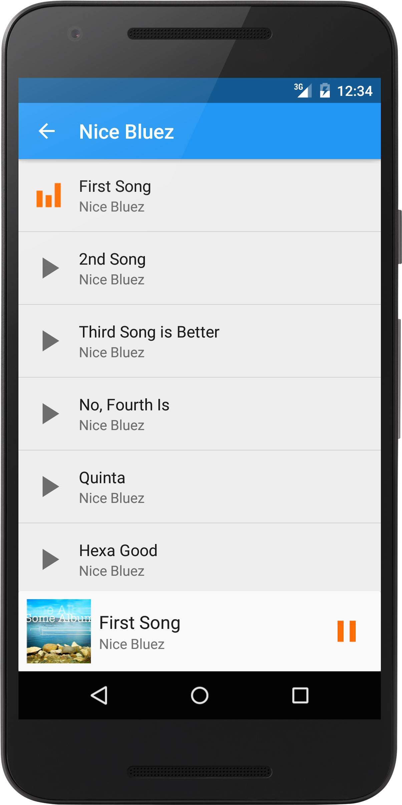
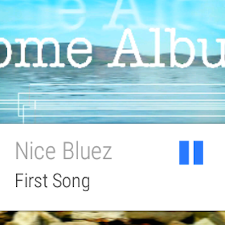

Kite Player
===========

This is a simplistic Android media player for songs stored on Dropbox.
It's also a universal player, with support for Google Cast, Android Wear and Android Auto.
It's built on top of [Universal Music Player](https://github.com/googlesamples/android-UniversalMusicPlayer).

Besides integrating Dropbox, several other aspects have been enhanced/improved:
- New theme and branding
- Better use of Material Design guidelines
- Persistent song library
- Proper image handling/caching
- User settings
- Conservative use of storage and bandwidth
- Better error handling
- Introduction of Dagger 2 and RxJava

Known Issues
------------

- **Android TV support**: Has been disabled due to lack of out-of-the box support for Dropbox authentication
- **Android Auto navigation**: By design and due to safety reasons, Android Auto limits any form of user interaction to 5 taps. If the user has a long or deep folder hierarchy the app should be smart to present the data differently so all if it is accessible to the user.

Screenshots
-----------

License
-------

Original work Copyright 2014 The Android Open Source Project, Inc.

Licensed to the Apache Software Foundation (ASF) under one or more contributor
license agreements.  See the NOTICE file distributed with this work for
additional information regarding copyright ownership.  The ASF licenses this
file to you under the Apache License, Version 2.0 (the "License"); you may not
use this file except in compliance with the License.  You may obtain a copy of
the License at

  http://www.apache.org/licenses/LICENSE-2.0

Unless required by applicable law or agreed to in writing, software
distributed under the License is distributed on an "AS IS" BASIS, WITHOUT
WARRANTIES OR CONDITIONS OF ANY KIND, either express or implied.  See the
License for the specific language governing permissions and limitations under
the License.

Modified work Copyright (c) 2015 Rafael Pereira

This Source Code Form is subject to the terms of the Mozilla Public License, v. 2.0.
If a copy of the MPL was not distributed with this file, You can obtain one at

  https://mozilla.org/MPL/2.0/